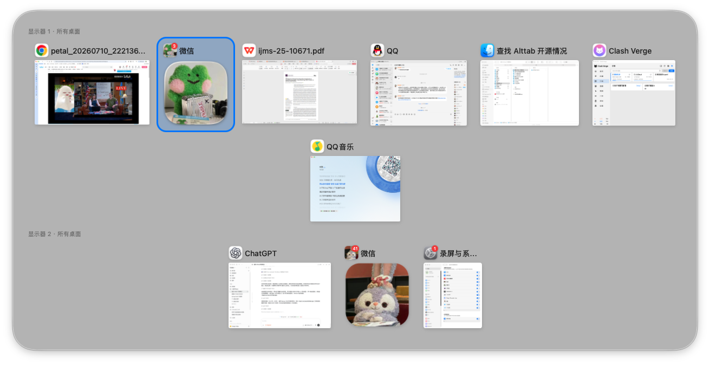
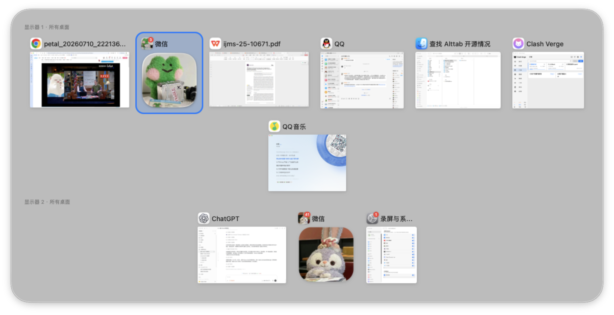
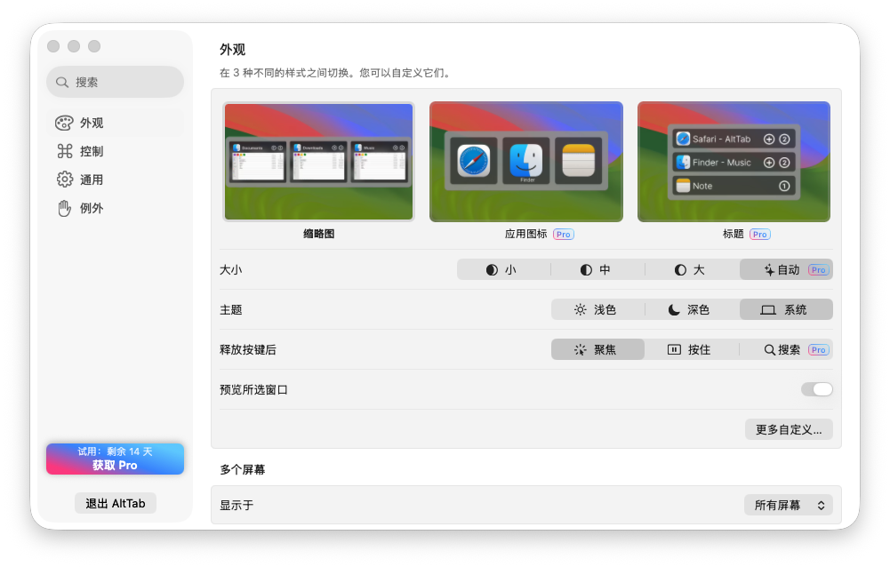
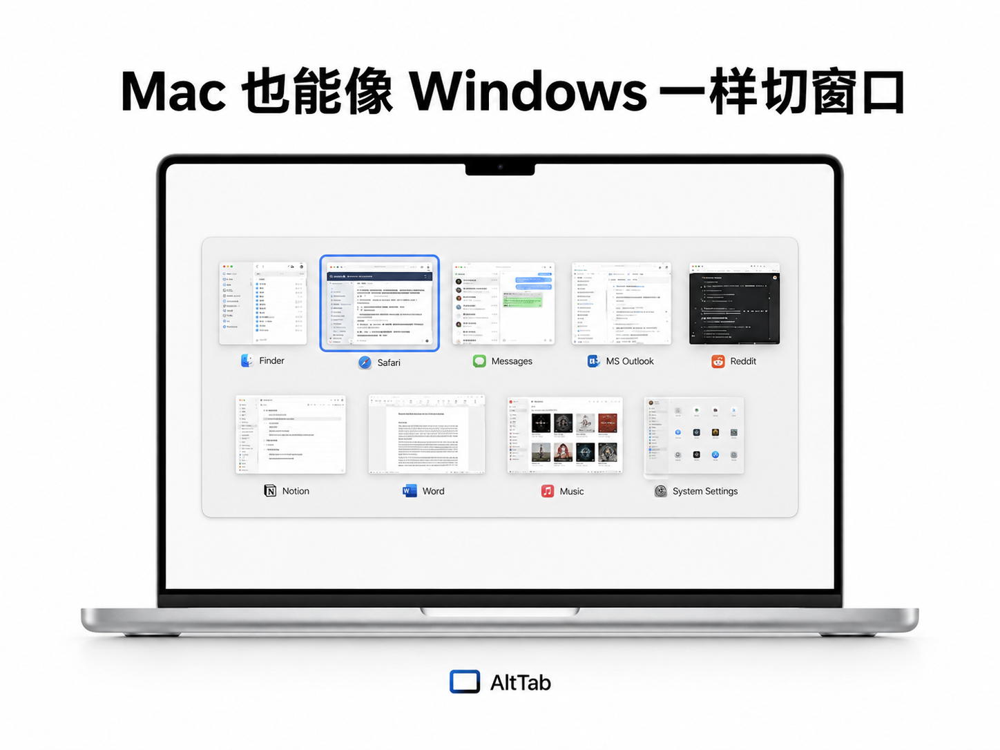

## 本 Fork 的多显示器模式

[下载当前定制版 v11.5.0.2](https://github.com/Qiushi0919/alt-tab-macos/releases/tag/v11.5.0.2)

在“多个屏幕 → 显示于”中选择“所有屏幕”后，触发快捷键会同时在每台显示器上显示切换界面。窗口按所在显示器分组，每组以“显示器 N · 所有桌面”标识。由于微信和微信 2 禁止 macOS 的按窗口截图，它们在切换器中使用应用图标，其他应用仍显示实时窗口缩略图。

定制版启动后每天读取一次本仓库的公开更新清单，也可在设置中手动检查。发现新版时只提示并打开 [Qiushi0919/alt-tab-macos Releases](https://github.com/Qiushi0919/alt-tab-macos/releases) 下载页，不会再安装上游官方版本。

### 实际运行截图

主显示器：

外接显示器（同时显示的镜像界面）：

“所有屏幕”设置：

### 概念图

下图是产品视觉方向的概念图，不是当前版本的一比一运行截图。

